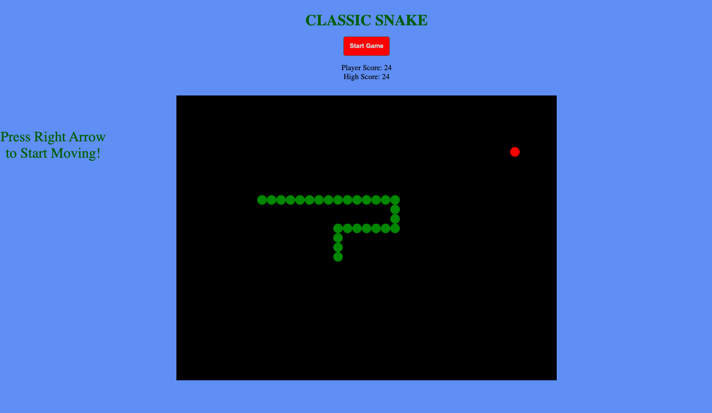

# Classic Snake Game

### This is a Snake-Game application based on the classic arcade game built using HTML CSS and Vanilla JavaScript
 
#### You can test the game [here](https://beethoven3579.github.io/Snake-Game/) 

## Project Summary

This was the most challenging app I have learned to build so far. I learned how to draw on HTML canvas with Javascript. I learned how to make shapes move on HTML canvas. I learned how to test for collisions and impliment conditions based on those collisions. Lastly, I learned how to use setInterval() in order to make objects move smoothly on the screen. 

## About Me

Nick Paolino -- Full-Time programming student -- [LinkedIn](https://www.linkedin.com/in/nick-paolino-00469291/)
